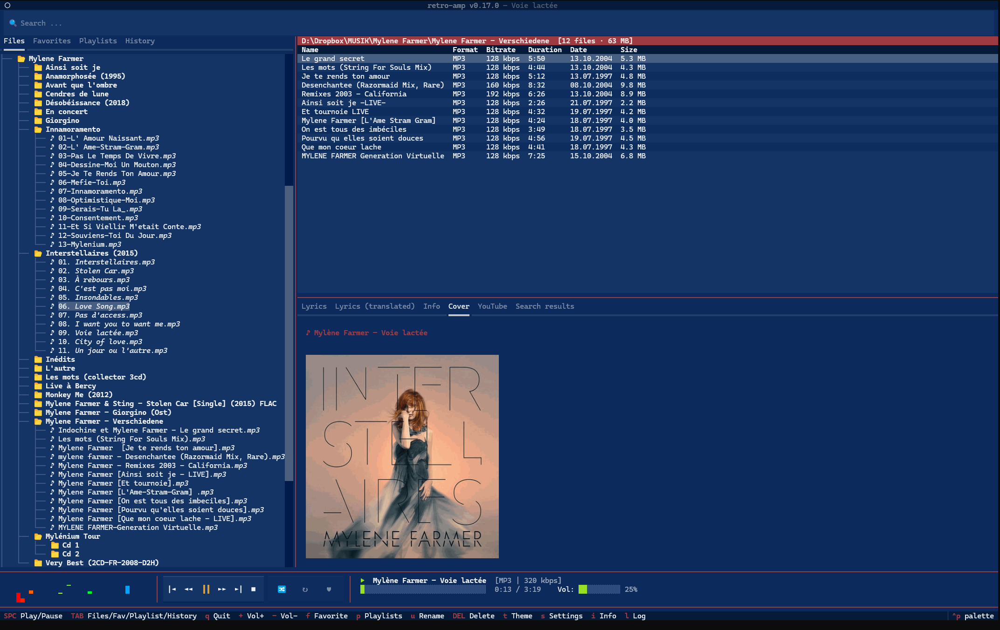
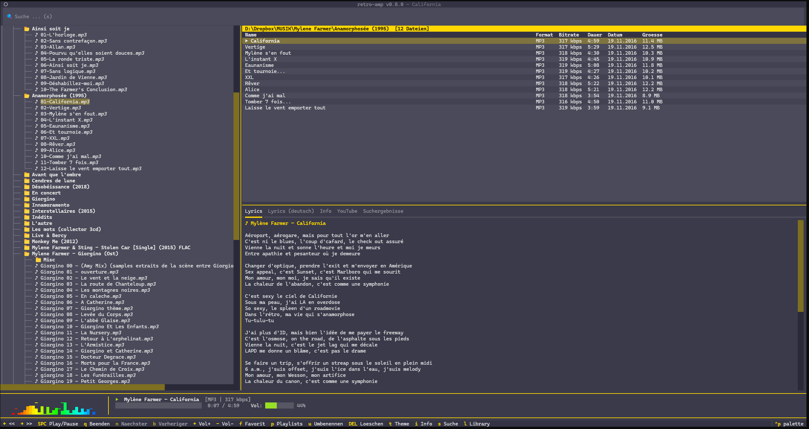
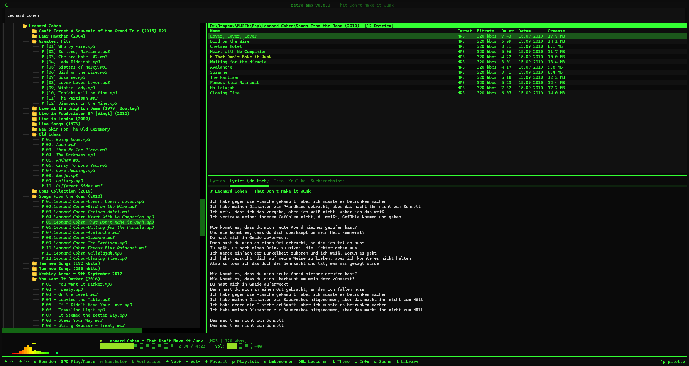
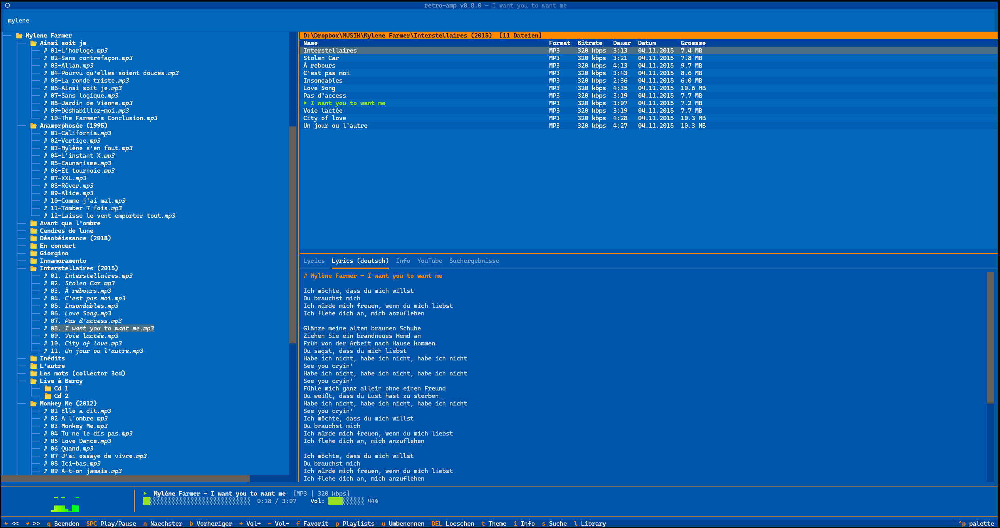
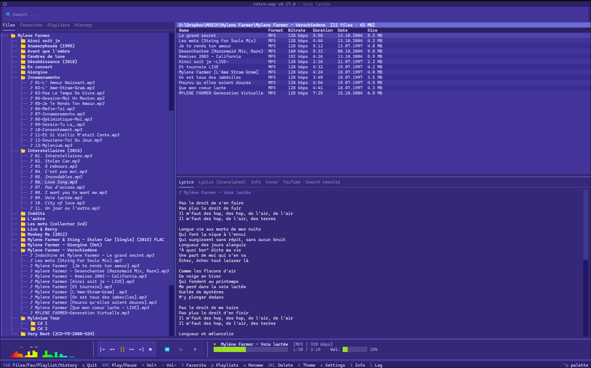
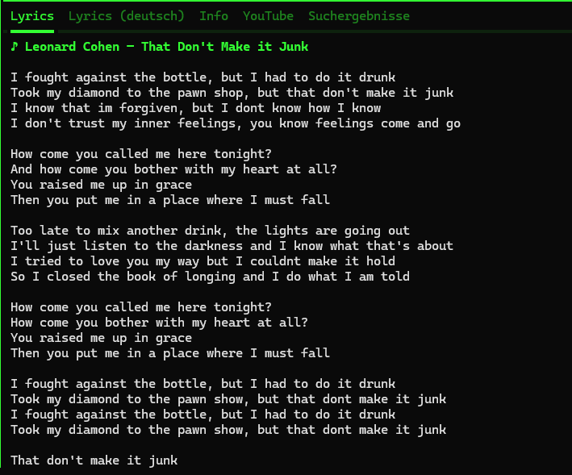

# retro-amp

<p align="center">
   <a href="README.md">English</a> ·
   <b>Deutsch</b>
</p>

---

[](https://github.com/michaelblaess/retro-amp/stargazers)
[](https://github.com/michaelblaess/retro-amp/network/members)
[](https://github.com/michaelblaess/retro-amp/issues)
[](https://github.com/michaelblaess/retro-amp/pulls)

[](https://github.com/michaelblaess/retro-amp/commits/main)
[](LICENSE)
[](https://www.python.org/)
[](https://github.com/michaelblaess/textual-themes)

Terminal-Musikplayer mit Retro-Charme — geschrieben in Python mit [Textual](https://textual.textualize.io/).


*Pixel-perfektes Cover-Rendering via TGP / Sixel — im Terminal.*


*BeBox Theme — Ordner-Browser, Datei-Tabelle, Lyrics, Spektral-Visualizer*

| | |
|---|---|
|  |  |
| *Classic Terminal — Phosphor-Grün* | *Boing — Blau/Orange* |

| | |
|---|---|
|  |  |
| *Brotkasten — YouTube-Links* | *Lyrics — Original (Englisch)* |

## Installation

### One-Click-Installer

Keine Abhängigkeiten nötig — kein Python, kein Git.

**Linux / macOS:**

```bash
curl -fsSL https://github.com/michaelblaess/retro-amp/releases/latest/download/install.sh | bash
```

**Windows (PowerShell als Administrator):**

```powershell
irm https://github.com/michaelblaess/retro-amp/releases/latest/download/install.ps1 | iex
```

### Installationspfade

| Plattform | Pfad |
|-----------|------|
| Linux | `~/.local/bin/retro-amp` |
| macOS | `/usr/local/bin/retro-amp` |
| Windows | `C:\Program Files\retro-amp\retro-amp.exe` |

### Optionale Abhängigkeit

Für M4A/AAC-Playback wird **ffmpeg** benötigt. Ohne ffmpeg werden alle anderen Formate normal abgespielt — nur M4A/AAC wird übersprungen (mit Log-Hinweis).

```bash
# Windows
choco install ffmpeg        # oder: scoop install ffmpeg / winget install ffmpeg

# Linux
sudo apt install ffmpeg

# macOS
brew install ffmpeg
```

### Manuell (Python >= 3.12)

```bash
pip install git+https://github.com/michaelblaess/retro-amp.git
retro-amp
```

### Aus Quellcode

```bash
git clone https://github.com/michaelblaess/retro-amp.git
cd retro-amp
python -m venv .venv
.venv/Scripts/activate      # Windows
# source .venv/bin/activate  # Linux/macOS
pip install -e ".[dev]"
retro-amp
```

## Benutzung

```bash
retro-amp                     # Startet mit Standard-Musikordner
retro-amp /pfad/zur/musik     # Startet in einem bestimmten Ordner
retro-amp song.mp3            # Spielt eine Datei direkt ab
retro-amp --lang en           # Startet mit englischer Oberfläche
retro-amp --version           # Zeigt die Version
```

## Features

- **Ordner-Browser** — Linkes Panel mit Verzeichnisbaum, filtert Audio-Dateien automatisch
- **Favoriten-Ansicht** — Alle Favoriten als Baumstruktur, mit TAB umschalten
- **Playlist-Ansicht** — Playlists als Baumstruktur, Songs direkt abspielen oder entfernen
- **Datei-Tabelle** — Rechtes Panel mit Name, Format, Bitrate, Dauer (via mutagen)
- **Audio-Playback** — MP3, M4A/AAC, OGG/Opus, FLAC, WAV, MOD/XM/S3M, SID (via pygame.mixer + pyogg + ffmpeg)
- **Spektral-Visualizer** — Echte FFT-Analyse, 5 Darstellungs-Modi (Bars, Blocks, Scope, Matrix, LCD VU-Meter im Kassettendeck-Style), Theme-bewusste Farben. Modus per Right-Click auf den Visualizer wechseln oder im Settings-Tab "Visualizer" konfigurieren.
- **Synced Lyrics** — Zeitgestempelte Lyrics von [lrclib.net](https://lrclib.net), farbig synchronisiert (gespielt/aktuell/kommend), Click-to-Seek auf jede Zeile, Auto-Scroll mit 3s Timeout nach manuellem Scrollen
- **Liner Notes** — Wikipedia-Info zum aktuellen Artist (Taste I), automatisch gecached
- **Album Cover Art** — Eingebettete Cover aus Audio-Tags (ID3, FLAC, MP4) oder Bilddateien im Ordner (cover.jpg, folder.jpg, etc.), gerendert als Unicode Half-Blocks via [Pillow](https://pillow.readthedocs.io/)
- **Globale Suche mit Verlauf** — Dateien in der gesamten Bibliothek suchen; Klick ins Suchfeld zeigt die letzten 20 Suchanfragen, beim Tippen werden passende Einträge gefiltert und Treffer hervorgehoben (Persistenz in SQLite). Treffer erscheinen im Tab "Suche" links als Baum, gruppiert nach übergeordnetem Verzeichnis — bei mehreren Treffern im selben Album-Ordner steht der Pfad nur einmal.
- **Playlists** — Als Markdown-Dateien gespeichert, Standard-Playlist "Favoriten"
- **Shuffle & Repeat** — Shuffle-Modus (X) und Repeat Off/All/One (R), kombinierbar
- **31 Retro-Themes** — vintage 8-bit, terminal, Unix workstation, watch, comic-pulp und 80s-pastel Palettes (siehe [textual-themes](https://github.com/michaelblaess/textual-themes))
- **Mehrsprachig** — Deutsch (Standard) und Englisch, umschaltbar via `--lang`
- **Session-Recovery** — Nach einem Crash wird der letzte Track und Ordner wiederhergestellt (ohne Auto-Play)
- **Crash-Schutz** — Ein unerwarteter Fehler öffnet einen Dialog mit kopierbarem Fehlerbericht, statt die App abstürzen zu lassen — du entscheidest, ob du weitermachst oder beendest
- **Debug-Log** — Ausführliches Log mit Artist/Titel, Pfaden, Events (Taste L). Rechtsklick auf das Log-Panel öffnet ein Kontextmenü — kopieren, als Textdatei exportieren oder ausblenden. Ein Splitter oberhalb des Panels passt die Größe an
- **Dateiverwaltung** — Umbenennen (U) und Löschen (DEL) direkt aus dem Player
- **Settings-Persistenz** — Lautstärke, letzter Ordner, Theme, Sprache werden gespeichert
- **Anpassbare Panels** — Mit der Maus kann die Größe zwischen Datei-Browser links und Datei-Tabelle/Lyrics rechts (vertikaler Splitter) sowie zwischen Datei-Tabelle und Lyrics (horizontaler Splitter) frei eingestellt werden. Layout wird in Settings persistiert.
- **Datei-Verknüpfung** — Doppelklick auf Audio-Datei öffnet retro-amp direkt
- **Single-Instance** — Zweiter Doppelklick sendet den Track an die laufende Instanz
- **Terminal-Tab-Titel** — Der Terminal-Tab zeigt den laufenden Track; wird vor dem Textual-Start gesetzt und während der Wiedergabe live aktualisiert

## Tastenbelegung

| Taste | Aktion |
|-------|--------|
| `Space` | Play / Pause |
| `+` `-` | Lautstärke |
| `TAB` | Ansicht wechseln: Dateien → Favoriten → Playlists → Verlauf |
| `↑` `↓` | Navigation in der Liste |
| `Enter` | Song abspielen / Ordner öffnen |
| `F` | Favorit hinzufügen/entfernen |
| `P` | Playlist-Menü |
| `U` | Datei umbenennen |
| `DEL` | Datei löschen |
| `T` | Theme wechseln |
| `S` | Einstellungen |
| `I` | Info / About |
| `L` | Debug-Log ein-/ausblenden |
| `C` | Debug-Log kopieren |
| `X` | Shuffle ein/aus |
| `R` | Repeat: Off → All → One |
| `Q` | Beenden |

Nächster/Vorheriger Track, Seek (5 s) und Globale Suche sind über die Steuerleiste und die Suchleiste per Maus erreichbar.

## Dateiverknüpfung

retro-amp kann als Standard-Player für Audio-Dateien registriert werden.

**Windows (PowerShell):**

```powershell
powershell -ExecutionPolicy Bypass -File register-file-types.ps1
```

**Windows (CMD):**

```batch
register-file-types.bat
```

**Linux:**

```bash
./register-file-types.sh
```

Doppelklick auf eine Audio-Datei startet retro-amp. Bei laufender Instanz wird der neue Track automatisch übernommen (Single-Instance).

## Themes

Mit `T` durch die Themes wechseln, oder per Theme-Picker (`Ctrl+P` → "theme").

retro-amp registriert alle Themes aus dem
[textual-themes](https://github.com/michaelblaess/textual-themes) Paket
(31 Themes — Dark + Light, von 8-bit über Terminal-Phosphor bis zu
80s-Pastel und Comic-Pulp). Die komplette Galerie mit Live-Carousel:
**[michaelblaess.github.io/textual-themes](https://michaelblaess.github.io/textual-themes/)**.

> **Migration aus älteren Versionen:** retro-amp 0.16+ migriert
> gespeicherte Theme-Slugs automatisch beim Laden — wer vorher z.B.
> `c64` als Lieblings-Theme hatte, landet auf dem umbenannten
> `brotkasten` ohne dass etwas zu tun ist.

## Spektral-Visualizer

- Echte FFT-basierte Analyse (stdlib `cmath`, kein numpy)
- 2048-Punkt-FFT mit Hann-Fenster
- 32 log-skalierte Frequenzbänder (20 Hz – 18 kHz)
- Spektralfarben: Rot (Bass) → Gelb → Grün → Cyan → Blau (Höhen)
- Peak-Hold mit fallendem Effekt
- 3-zeilige Multi-Row-Darstellung (24 Höhenstufen)
- PCM-Laden im Hintergrund-Thread

## Playlists

Playlists werden als Markdown-Dateien in `~/.retro-amp/playlists/` gespeichert:

```markdown
# Favoriten

- D:\Dropbox\MUSIK\Kraftwerk\autobahn.mp3
- D:\Dropbox\MUSIK\C64\last_ninja.sid
```

- `F` — Song zu Favoriten hinzufügen/entfernen
- `P` — Playlist-Menü: neue erstellen, bestehende laden, Song hinzufügen

## Architektur

Clean Architecture mit strikter Dependency Rule:

```
src/retro_amp/
├── domain/           # Models, Protocols — keine externen Imports
│   ├── models.py     #   AudioTrack, PlayerState, Playlist
│   └── protocols.py  #   AudioPlayer, MetadataReader, PlaylistRepository
├── services/         # Business-Logik — importiert nur domain/
│   ├── player_service.py
│   ├── playlist_service.py
│   └── metadata_service.py
├── infrastructure/   # Implementierungen — pygame, mutagen, JSON
│   ├── audio_player.py    # PygameAudioPlayer
│   ├── spectrum.py        # SpectrumAnalyzer (FFT)
│   ├── metadata_reader.py # MutagenMetadataReader + Cover-Art-Extraktion
│   ├── playlist_store.py  # MarkdownPlaylistStore
│   ├── settings.py        # JsonSettingsStore
│   ├── session.py         # Crash-Recovery (session.json)
│   └── single_instance.py # Single-Instance Lock + Play-Request
├── widgets/          # Textual Widgets
├── screens/          # Textual ModalScreens
├── i18n.py           # Internationalisierung (de/en)
├── locale/           # JSON-Sprachpakete (de.json, en.json)
├── themes.py         # Re-Export aus textual-themes
└── app.py            # Composition Root
```

## Entwicklung

```bash
# Setup
git clone https://github.com/michaelblaess/retro-amp.git
cd retro-amp
python -m venv .venv
.venv/Scripts/activate      # Windows
pip install -e ".[dev]"

# Tests
pytest

# Type-Check
mypy src/
```

### Lokaler Build (Standalone-Binary)

Zwei Wege zu einer eigenständigen Binary, die ohne Python-Installation läuft:

**PyInstaller** — bündelt den CPython-Interpreter, schnell eingerichtet:

```bash
pip install pyinstaller
pyinstaller retro-amp.spec --noconfirm
```

**Nuitka** — kompiliert zu einer nativen Binary (schnellerer Kaltstart, ein
verteilbares Archiv). Ein Skript pro OS; jedes führt zuerst `uv sync` aus und
schreibt nach `dist/`:

```bash
.\compile-win64.ps1     # Windows -> dist/retro-amp-vX.Y.Z-win64.zip
./compile-linux.sh      # Linux   -> dist/retro-amp-vX.Y.Z-linux-x86_64.tar.gz
./compile-macos.sh      # macOS   -> dist/retro-amp-vX.Y.Z-macos-<arch>.tar.gz
```

Nuitka braucht `nuitka` im venv (`uv pip install nuitka`) und einen C-Compiler —
Windows: MSVC; Linux: `gcc patchelf python3-dev`; macOS: Xcode Command Line Tools.
Nuitka cross-kompiliert nicht — jedes OS wird auf dem jeweiligen OS gebaut.

### Release erstellen

```bash
git tag v0.4.0
git push origin v0.4.0
# GitHub Actions baut automatisch Windows/macOS/Linux Installer
```

## Tech-Stack

| Komponente | Library |
|------------|---------|
| TUI-Framework | [Textual](https://textual.textualize.io/) >= 8.2.6 |
| Rich Text | [Rich](https://rich.readthedocs.io/) >= 13.0 |
| Audio-Playback | [pygame.mixer](https://www.pygame.org/) >= 2.5 |
| Audio-Metadaten | [mutagen](https://mutagen.readthedocs.io/) >= 1.47 |
| Album Cover Art | [Pillow](https://pillow.readthedocs.io/) >= 10.0 |
| Cover-Rendering (TGP/Sixel) | [textual-image](https://github.com/lnqs/textual-image) >= 0.12 |
| Themes | [textual-themes](https://github.com/michaelblaess/textual-themes) >= 0.8 |
| UI-Widgets (About-Dialog, Crash-Schutz, Such-Verlauf, Kontextmenü, Splitter) | [textual-widgets](https://github.com/michaelblaess/textual-widgets) >= 0.10 |
| Lyrics-API | [lrclib.net](https://lrclib.net/) (synced + plain) |
| Testing | pytest, pytest-asyncio, pytest-cov |
| Type-Checking | mypy (strict) |

## Inspiration & Dank

Synced Lyrics, Album Art Rendering und Session-Recovery wurden inspiriert von [ytm-player](https://github.com/peternaame-boop/ytm-player) — einem YouTube-Music-Player in Textual.

Mehrere Visualizer-Modi und das UX-Konzept "Player-First, Fokus auf Tastatur" wurden inspiriert von [cliamp](https://github.com/bjarneo/cliamp) ([cliamp.stream](https://www.cliamp.stream/)) von **[@bjarneo](https://github.com/bjarneo)** — einem Winamp-inspirierten Terminal-Player in Go.

Pixelgenaues Cover-Rendering via TGP (Kitty-Protokoll) und Sixel basiert auf der großartigen [textual-image](https://github.com/lnqs/textual-image) von **[@lnqs](https://github.com/lnqs)** — herzlichen Dank!

## Lizenz

Apache License 2.0 — siehe [LICENSE](LICENSE).

## Autor

Michael Blaess — [GitHub](https://github.com/michaelblaess)
