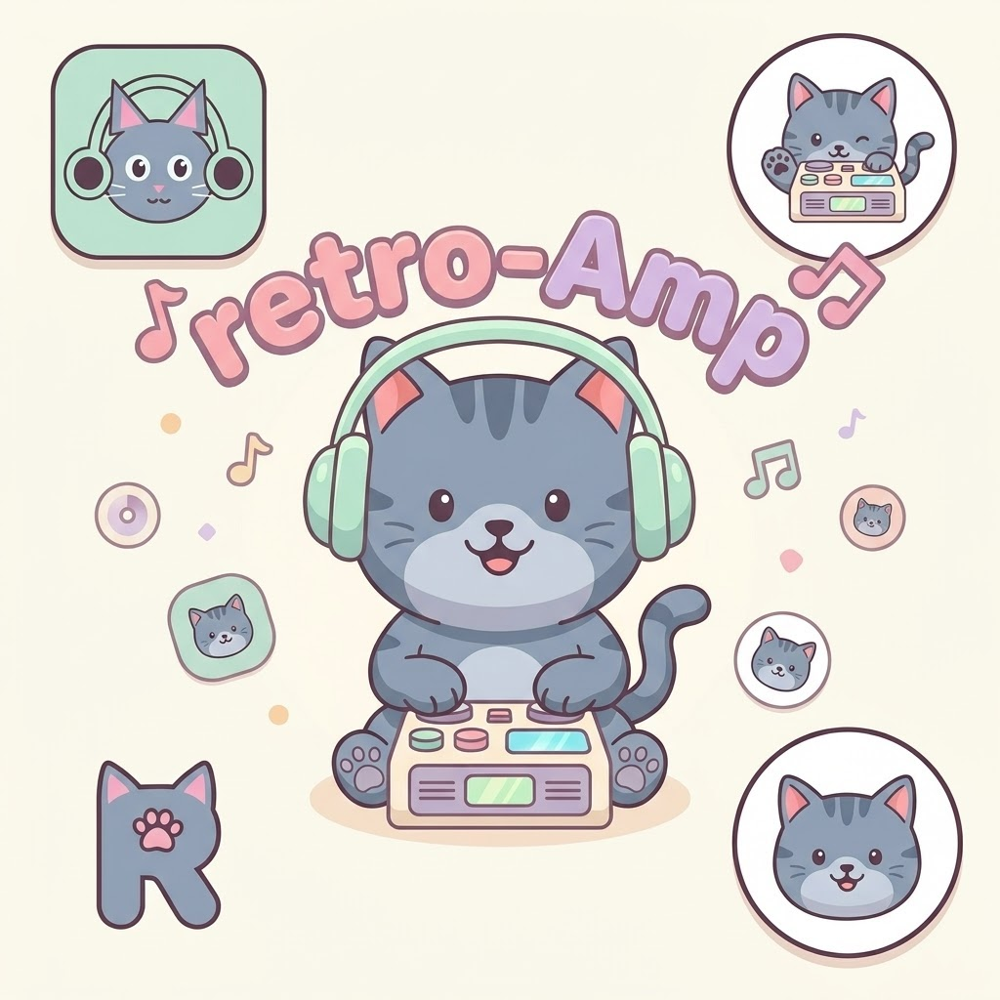

<p align="center">
  
</p>

# retro-amp

<p align="center">
   <b>English</b> ·
   <a href="README.de.md">Deutsch</a>
</p>

---

[](https://github.com/michaelblaess/retro-amp/stargazers)
[](https://github.com/michaelblaess/retro-amp/network/members)
[](https://github.com/michaelblaess/retro-amp/issues)
[](https://github.com/michaelblaess/retro-amp/pulls)

[](https://github.com/michaelblaess/retro-amp/commits/main)
[](LICENSE)
[](https://www.python.org/)
[](https://github.com/michaelblaess/textual-themes)

A terminal music player with retro charm — built with Python and [Textual](https://textual.textualize.io/).


*Pixel-perfect cover rendering via TGP / Sixel — in the terminal.*


*BeBox theme — folder browser, file table, lyrics, spectral visualizer*

| | |
|---|---|
|  |  |
| *Classic Terminal — phosphor green* | *Boing — blue/orange* |

| | |
|---|---|
|  |  |
| *Brotkasten — YouTube links* | *Lyrics — original (English)* |

## Installation

### One-Click Installer

No dependencies needed — no Python, no Git.

**Linux / macOS:**

```bash
curl -fsSL https://github.com/michaelblaess/retro-amp/releases/latest/download/install.sh | bash
```

**Windows (PowerShell as Administrator):**

```powershell
irm https://github.com/michaelblaess/retro-amp/releases/latest/download/install.ps1 | iex
```

### Installation Paths

| Platform | Path |
|----------|------|
| Linux | `~/.local/bin/retro-amp` |
| macOS | `/usr/local/bin/retro-amp` |
| Windows | `C:\Program Files\retro-amp\retro-amp.exe` |

### Optional Dependency

For M4A/AAC playback, **ffmpeg** is required. Without ffmpeg, all other formats play normally — only M4A/AAC is skipped (with a log message).

```bash
# Windows
choco install ffmpeg        # or: scoop install ffmpeg / winget install ffmpeg

# Linux
sudo apt install ffmpeg

# macOS
brew install ffmpeg
```

### Manual (Python >= 3.12)

```bash
pip install git+https://github.com/michaelblaess/retro-amp.git
retro-amp
```

### From Source

Needs [uv](https://docs.astral.sh/uv/). `bootstrap` creates the `.venv`,
installs all dependencies from `uv.lock` and the Nuitka build tool.

```bash
git clone https://github.com/michaelblaess/retro-amp.git
cd retro-amp
.\bootstrap.ps1     # Windows      (Linux/macOS: ./bootstrap.sh)
.\run.ps1           # start it      (Linux/macOS: ./run.sh)
```

## Usage

```bash
retro-amp                     # Start with default music folder
retro-amp /path/to/music      # Start in a specific folder
retro-amp song.mp3            # Play a file directly
retro-amp --lang en           # Start with English UI
retro-amp --version           # Show version
```

## Features

- **Folder browser** — Left panel with directory tree, automatically filters audio files. Right-click opens a context menu: for folders play, expand/collapse, **collapse all**, add to playlist, set as music library, rename and delete - for files also favorite and automatic title completion
- **Quick-jump sidebar** — At the top of the Files tab: Home, Music (= configured library), XDG folders (Downloads, Desktop, Documents, Pictures, Videos) and accessible drives. Clicking an entry switches the tree root *temporarily* — the persistent library stays untouched, the friendly label (e.g. `💾 C:\`, `📁 Downloads`) is also shown as the tree root
- **Favorites view** — All favorites as a tree, toggle with TAB
- **Context menus in every left-hand tree** — Right-click an entry in favorites, history or search: play, add or remove favorite, add to playlist and "show in folder tree" (switches to the files tab and marks the file there). On group nodes expand/collapse and **collapse all**. Entries whose file has disappeared are greyed out
- **Playlist view** — Playlists as a tree, play or remove songs directly
- **File table** — Right panel with name, format, bitrate, duration, date and size (via mutagen). Clicking a column header sorts by that column, a second click reverses the direction. The ▲/▼ arrow marks the active sort, and the playback order follows the visible sort order.
- **Audio playback** — MP3, M4A/AAC, OGG/Opus, FLAC, WAV, MOD/XM/S3M, SID (via pygame.mixer + pyogg + ffmpeg)
- **Spectral visualizer** — Real FFT analysis, 5 display modes (Bars, Blocks, Scope, Matrix, LCD VU meter in cassette-deck style), theme-aware colors. Switch mode by right-clicking the visualizer or configure it in the "Visualizer" settings tab.
- **Synced lyrics** — Time-stamped lyrics from [lrclib.net](https://lrclib.net), color-synced (played/current/upcoming), click-to-seek on any line, auto-scroll with a 3s timeout after manual scrolling
- **Liner notes** — Wikipedia info on the current artist (key I), cached automatically
- **Album cover art** — Embedded covers from audio tags (ID3, FLAC, MP4) or image files in the folder (cover.jpg, folder.jpg, etc.), rendered as Unicode half-blocks via [Pillow](https://pillow.readthedocs.io/)
- **Global search with history** — Search files across the whole library; clicking the search field shows the last 20 queries, typing filters matching entries and highlights hits (persisted in SQLite). Hits appear in the "Search" tab on the left as a tree, grouped by parent directory — when several hits share the same album folder, the path is shown only once.
- **Playlists** — Stored as Markdown files, default playlist "Favorites"
- **Shuffle & repeat** — Shuffle mode (X) and Repeat Off/All/One (R), combinable
- **38 retro themes** — vintage 8-bit, terminal, Unix workstation, watch, comic-pulp and 80s-pastel palettes (see [textual-themes](https://github.com/michaelblaess/textual-themes))
- **Settings dialog** — tabbed settings (key S): library default directory, cover renderer, visualizer mode, database journal mode, history, auto-title (MusicBrainz / AcoustID API key), language, plus a storage tab that opens the data folders (settings.json, database, caches)
- **Footer tooltips** — hover over any key in the footer to see a full description of what the command does
- **Clickable links** — links in the About dialog, Wikipedia source and YouTube panel open on a normal click (no Ctrl needed) and highlight on hover
- **Multilingual** — German (default) and English, switchable via `--lang` or the Settings dialog (Language tab)
- **Session recovery** — After a crash, the last track and folder are restored (without auto-play)
- **Crash guard** — An unexpected error opens a dialog with a copyable error report instead of crashing the app — you decide whether to continue or quit
- **Debug log** — Detailed log with artist/title, paths, events (key L). Right-click the log panel for a context menu — copy, export to a text file, or hide it. A splitter above the panel resizes it
- **File management** — Rename (U) and delete (DEL) directly from the player
- **Auto-title (fill in missing titles)** — For files that only carry a track number (`01.mp3`, `Track 07.mp3`), key `G` gathers title proposals from three sources — embedded ID3 tags, [AcoustID](https://acoustid.org/) audio fingerprint and the [MusicBrainz](https://musicbrainz.org/) tracklist — and shows a preview dialog before anything changes. Confirmed matches are preselected, the heuristic MusicBrainz tracklist is not. Accepted files are renamed to `NN - Title.ext` and the title is written into the tag; see the [Auto-title](#auto-title) section
- **Settings persistence** — Volume, last folder, theme and language are saved
- **Resizable panels** — The mouse can freely adjust the size between the file browser on the left and the file table/lyrics on the right (vertical splitter), as well as between file table and lyrics (horizontal splitter). The layout is persisted in settings.
- **File association** — Double-click an audio file to open retro-amp directly
- **Single instance** — A second double-click sends the track to the running instance
- **Terminal tab title** — The terminal tab shows the playing track; set before Textual starts and updated live during playback

## Keybindings

| Key | Action |
|-----|--------|
| `Space` | Play / Pause |
| `+` `-` | Volume |
| `TAB` | Cycle view: Files → Favorites → Playlists → History |
| `↑` `↓` | Navigate list |
| `Enter` | Play track / Open folder |
| `F` | Toggle favorite |
| `P` | Playlist menu |
| `U` | Rename file |
| `G` | Auto-title (fill in missing titles) |
| `DEL` | Delete file |
| `T` | Cycle theme |
| `S` | Settings |
| `I` | Info / About |
| `L` | Toggle debug log |
| `C` | Copy debug log |
| `X` | Toggle shuffle |
| `R` | Repeat: Off → All → One |
| `Q` | Quit |

Next/previous track, seeking (5 s) and global search are available via the control bar and search field (mouse).

## File Association

retro-amp can be registered as the default player for audio files.

**Windows (PowerShell):**

```powershell
powershell -ExecutionPolicy Bypass -File register-file-types.ps1
```

**Windows (CMD):**

```batch
register-file-types.bat
```

**Linux:**

```bash
./register-file-types.sh
```

Double-click an audio file to start retro-amp. If it is already running, the new track is sent to the existing instance (single-instance).

## Themes

Press `T` to cycle through themes, or use the theme picker (`Ctrl+P` → "theme").

retro-amp registers all themes from the
[textual-themes](https://github.com/michaelblaess/textual-themes) package
(38 themes — dark + light, from 8-bit through terminal phosphor to
80s-pastel and comic-pulp). The full gallery with a live carousel:
**[michaelblaess.github.io/textual-themes](https://michaelblaess.github.io/textual-themes/)**.

> **Migrating from older versions:** retro-amp 0.16+ migrates stored
> theme slugs automatically on load — anyone who previously had e.g.
> `c64` as their favorite theme ends up on the renamed
> `brotkasten` without doing anything.

## Spectral Visualizer

- Real FFT-based analysis (stdlib `cmath`, no numpy)
- 2048-point FFT with Hann window
- 32 log-scaled frequency bands (20 Hz – 18 kHz)
- Spectral colors: red (bass) → yellow → green → cyan → blue (treble)
- Peak-hold with a falling effect
- 3-row multi-row display (24 height levels)
- PCM loading in a background thread

## Playlists

Playlists are stored as Markdown files in `~/.retro-amp/playlists/`:

```markdown
# Favoriten

- D:\Dropbox\MUSIK\Kraftwerk\autobahn.mp3
- D:\Dropbox\MUSIK\C64\last_ninja.sid
```

- `F` — Add/remove a song to favorites
- `P` — Playlist menu: create a new one, load an existing one, add a song

## Auto-title

Files that only have a track number in the name (`01.mp3`, `Track 07.mp3`) can
get their real titles filled in. Press `G` on a folder — retro-amp gathers
proposals and shows a **preview dialog** (confirm / cancel) before touching
anything. Rows without a reliable match stay unchanged.

Four sources, in order of certainty:

1. **Embedded ID3 tag** — deterministic, preselected. A generic placeholder tag
   (`Track 01`, `Untitled`) is treated as missing so a real title can be found.
2. **AcoustID audio fingerprint** — identifies the title from the actual audio
   ([acoustid.org](https://acoustid.org/)); the most reliable online source,
   preselected. Requires the `fpcalc` tool (Chromaprint) and a free
   *Application API key* (Settings → Auto-title). Off by default.
3. **MusicBrainz tracklist** — matches folder = album and filename number =
   track against the [MusicBrainz](https://musicbrainz.org/) tracklist. This is
   heuristic — only an exact track-count match with plausible durations is
   accepted — so it is shown in yellow and **not** preselected; you confirm it.
   On by default.
4. **Filename fallback** — last resort: if no source finds a title but the
   filename carries one (`01 Jonny Controletti.mp3`), the title is taken from the
   filename. Not preselected. On by default.

Accepted rows are renamed to `NN - Title.ext` and the title is written into the
file's tag. **When the filename already contains the title (only the tag was
missing or generic), only the tag is written — the file is not renamed.** The
currently playing file is unloaded for the change and resumed at the same
position; playlist and history paths are updated automatically.

## Architecture

Clean architecture with a strict dependency rule:

```
src/retro_amp/
├── domain/           # Models, protocols — no external imports
│   ├── models.py     #   AudioTrack, PlayerState, Playlist
│   └── protocols.py  #   AudioPlayer, MetadataReader, PlaylistRepository
├── services/         # Business logic — imports domain/ only
│   ├── player_service.py
│   ├── playlist_service.py
│   └── metadata_service.py
├── infrastructure/   # Implementations — pygame, mutagen, JSON
│   ├── audio_player.py    # PygameAudioPlayer
│   ├── spectrum.py        # SpectrumAnalyzer (FFT)
│   ├── metadata_reader.py # MutagenMetadataReader + cover-art extraction
│   ├── playlist_store.py  # MarkdownPlaylistStore
│   ├── settings.py        # JsonSettingsStore
│   ├── session.py         # Crash recovery (session.json)
│   └── single_instance.py # Single-instance lock + play request
├── widgets/          # Textual widgets
├── screens/          # Textual ModalScreens
├── i18n.py           # Internationalization (de/en)
├── locale/           # JSON language packs (de.json, en.json)
├── themes.py         # Re-export from textual-themes
└── app.py            # Composition root
```

## Development

```bash
# Setup (uv: .venv + dev dependencies + Nuitka)
git clone https://github.com/michaelblaess/retro-amp.git
cd retro-amp
.\bootstrap.ps1     # Windows      (Linux/macOS: ./bootstrap.sh)

# Tasks (poethepoet, defined in pyproject.toml)
uv run poe test         # pytest
uv run poe typecheck    # mypy strict
uv run poe lint         # ruff
uv run poe run          # start retro-amp
```

### Local build (standalone binary)

**Nuitka** compiles retro-amp to a native, self-contained binary that runs
without a Python install (one distributable archive per OS). One script per OS;
each runs `uv sync` first and writes to `dist/`:

```bash
.\compile-win64.ps1     # Windows -> dist/retro-amp-vX.Y.Z-win64.zip
./compile-linux.sh      # Linux   -> dist/retro-amp-vX.Y.Z-linux-x86_64.tar.gz
./compile-macos.sh      # macOS   -> dist/retro-amp-vX.Y.Z-macos-<arch>.tar.gz
```

Nuitka needs `nuitka` in the venv (`uv pip install nuitka`) and a C compiler —
Windows: MSVC; Linux: `gcc patchelf python3-dev`; macOS: Xcode Command Line Tools.
Nuitka does not cross-compile — build each OS on that OS.

### Create a Release

```bash
git tag v0.4.0
git push origin v0.4.0
# GitHub Actions automatically builds the Windows/macOS/Linux installers
```

## Tech Stack

| Component | Library |
|-----------|---------|
| TUI framework | [Textual](https://textual.textualize.io/) >= 8.2.6 |
| Rich text | [Rich](https://rich.readthedocs.io/) >= 13.0 |
| Audio playback | [pygame.mixer](https://www.pygame.org/) >= 2.5 |
| Audio metadata | [mutagen](https://mutagen.readthedocs.io/) >= 1.47 |
| Album cover art | [Pillow](https://pillow.readthedocs.io/) >= 10.0 |
| Cover rendering (TGP/Sixel) | [textual-image](https://github.com/lnqs/textual-image) >= 0.12 |
| Themes | [textual-themes](https://github.com/michaelblaess/textual-themes) >= 0.8 |
| UI widgets (about dialog, crash guard, settings dialog, search history, context menu, splitter) | [textual-widgets](https://github.com/michaelblaess/textual-widgets) >= 0.25 |
| Lyrics API | [lrclib.net](https://lrclib.net/) (synced + plain) |
| Title lookup (fingerprint) | [AcoustID](https://acoustid.org/) + Chromaprint `fpcalc` |
| Title lookup (tracklist) | [MusicBrainz](https://musicbrainz.org/) |
| Testing | pytest, pytest-asyncio, pytest-cov |
| Type checking | mypy (strict) |

## Credits

Synced lyrics, album art rendering, and session recovery were inspired by [ytm-player](https://github.com/peternaame-boop/ytm-player) — a YouTube Music player built with Textual.

Multiple visualizer modes and the "player-first, keyboard-driven" UX approach were inspired by [cliamp](https://github.com/bjarneo/cliamp) ([cliamp.stream](https://www.cliamp.stream/)) by **[@bjarneo](https://github.com/bjarneo)** — a Winamp-inspired terminal player written in Go.

Pixel-perfect cover rendering via TGP (Kitty protocol) and Sixel is powered by the wonderful [textual-image](https://github.com/lnqs/textual-image) library by **[@lnqs](https://github.com/lnqs)** — many thanks!

## License

Apache License 2.0 — see [LICENSE](LICENSE).

## Author

Michael Blaess — [GitHub](https://github.com/michaelblaess)
